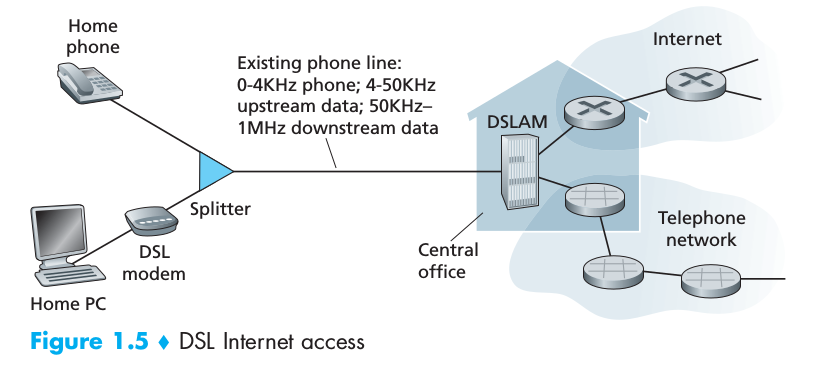
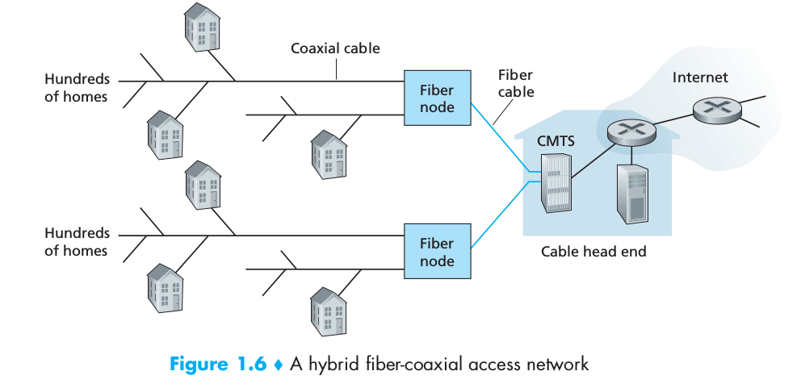
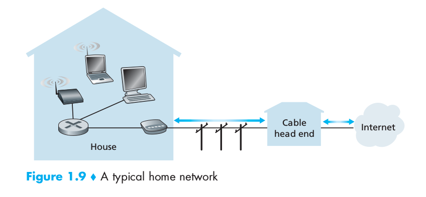
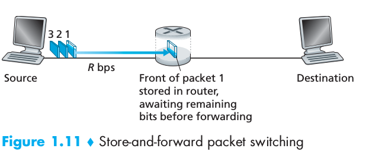

# Chapter 1: Computer Networks and the Internet

## Basic Concepts

* Internet: 
    * computer network that interconnects hundreds of millions of computing devices throughout the world. These devices are called `hosts (client or server)` or `end systems`. 
    * an insfrastucture that provides services to applications (`distributed applications`).
  
  

End systems are connected together by a network of `communication links` and `packet switches`. Different links can transmit data at different rates, with the `transmission rate` measured in bits/second. When one end system has data to send to another end system, the sending end system segments the data and adds header bytes to each segmente. The resulting packages of information, are called `packets`.

A packet switch (the two most prominent are `routers` and `link-layer switches`) takes a packet arriving on one of its incoming communication links and forwards that packet on one of its outgoing communication links.
* Link-layer switches: typically used in access networks.
* Routers: typically used in the network core.

The sequence of communication links and packet switches traversed by a packet from the sending end system to the receiving end system is known as a `route` or `path` through the network.

End systems access the Internet through `Internet Service Providers (ISPs)`. End systems, packet switches, and other pieces of the Internet run `protocols` that control the sending and receiving of information within the Internet. The `Transmission Control Protocol (TCP)` and the `Internet Protocol (IP)` are two of the most important protocols in the Internet.

`Internet standars` are developed by the `Internet Engineering Task Force (IETF)`. The IETF standards documents are called `request for comments (RFC's)`. They define protocols such as TCP, IP, HTTP and SMTP (Simple Mail Transfer Protocol => for e-mail).

End systems attached to the Internet provide an `Application Programming Interface (API)` that specifies how a program running on one end system asks the Internet infrastucture to deliver data to a specific destination program running on another end system.

* `Protocol`: defines the format and the order of messages exchanged between two or more communicating entities, as well as the actions taken on the transmission and/or receipt of a message or other event.

## Home Access

In both of these, access is `asymmetric`.

* `Digital Subscriber Line (DSL)` => DSL modem uses the existing telephone line to exchange data with a difital subscriber line access multiplexer (`DSLAM`) located in the telco's local central office (`CO`). The home's DSL modem takes digital data and translates it to high-frequency tones for transmission over telephone wires to the CO; the analog signals from many such houses are translated back into digital format at the DSLAM.

* `Hybrid FIber Coax (HFC)` => it makes use of the cable television company's existing cable televesion insfrastucture. Fiber optics connect the cable head end to neighborhood-level junctions, from which traditional coaxial cable is then used to reach individual houses and apartments. This requires special modems, called `cable modems`. It is typically an external device and connects to the home PC through an Ethernet port. At the cable head end, the`cable modem termination system (CMTS)` serves a similar function as the DSL network's DSLAM: divide the HFC network into two channels, a downstream and an upstream channel.

## Access in the Enterprise (and the home): Ethernet and WiFi.

On corporate and university campuses, and increasingly in home settings, a `local area network (LAN)` is used to connect and end system to the edge router. Ethernet is by far the most prevalent access technology in corporate, universtiy and home networks.

Ethernet users use twisted-pair copper wire to connect to an Ethernet switch. The Ethernet switch, is then in turn connected into the largar Internet.

## The NetWork Core

### Packet Switching

In a network application, end systems exchange messages with each other. Messages can contain anything the application designer wants. To send a message from a source end system to a destination end system, the source breaks long messages into smaller chunks of data known as `packets`. Between source and destination, each packet travels through communication links and packet switches (`routers` and `link-layer switches`). Packets are transmitted over each communication link at a rate equal to the full transmission rate of the link. So, if a source end system or a packet switch is sending a packet of L bits over a link with transmission rate R bits/sec, then the time to transmit the packet is L/R seconds.

### Store-and-Forward Transmission

Most packets switches use store-and-forward transmission at the inputs to the links. Store-and-forward transmissions means that the packet switch must receive the entire packet before it can begin to transmit the first bit of the packet onto the outbound link.

Due to this fact, the end-to-end delay for sending a packet over a path of N links each of rate R (thus, there are N-1 routers between source and destination) is: 

$$ d_{end-to-end}=N\frac{L}{R}$$

### Queuing Delays and Packet Loss

Each packet switch has multiple links attached to it. For each attached link, the packet switch has an `output buffer` (also called an `output queue`), which stores packets that the router is about to send into that link. If an arriving packet needs to be transmitted onto a link but finds the link bussy with the transmission of another packet, the arriving packet must wait in the output buffer. Thus, in addition to the store-and-forward delays, packets suffer output buffer `queuing delays`. Since the amount of buffer amount is finite, an arriving packet may find that the buffer is completely full with other packets waiting for transmission. In this case, `packet loss` will occur - either the arriving packet or one of the alread-queued packets will be dropped.

### Forwarding Tables and Routing Protocols

In the Internet, every end system has an address called an IP address. When a source end system wants to send a packet to a destination end system, the source **includes the destination's IP address in the packet's header**. When a packet arrives at a router in the network, the router examines a portion of the packet's destination address and forwards the packet to an adjacent router. More specifically, each router has a `forwarding table` that maps destination addresses (or portions of the destination addresses) to that router's outbound links. `Routing protocols` are used to automatically set the forwarding tables => a routing protocol may, for example, determine the shortest path results to configure the forwarding tables in the routers.

[Here you can trace the end-to-end paths](http://www.traceroute.org)

### Circuit Switching

`Circuit` => Before the sender can send the information, the network must establish a connection between the sender and the receiver. This is a *bona fide* connection, for wich the switches on the path between the and receiver maintain connection state for that connection. This connection, is ussually called a `circuit`. When the network establishes the ciurcuit, it also reserves a constant transmission rate in the network's links for the duration of the connection. Since a given transmission rate has been reserved for this sender-to-receiver connection, the sender can transfer the data to the receiver at the *guaranted* constant rate.

## Networks of Networks

<----Explicar brevemente los Internet Structure 1,2,3,4,5, PoP, IXP, etc ----->