### Instalación y configuración de Zabbix

Nos conectamos a Ubuntu y CentOS en dos terminales mediante:

```
ssh antonio@192.168.56.4
ssh antonio@192.168.56.5
```

Una vez conectados, en Ubuntu, instalamos Zabbix como indica en la [página de instalación](https://www.zabbix.com/documentation/3.4/manual/installation/install_from_packages/debian_ubuntu):

```
wget https://repo.zabbix.com/zabbix/3.4/ubuntu/pool/main/z/zabbix-release/zabbix-release_3.4-1+xenial_all.deb
dpkg -i zabbix-release_3.4-1+bionic_all.deb
apt update
```


Ahora vamos a instalar el servidor, el proxy y el frontend, usando MySQL aprovechando que ya lo tenemos
instalados de la práctica anterior:

```
apt install zabbix-server-mysql
apt install zabbix-proxy-mysql
apt install zabbix-frontend-php
```


Ahora vamos a crear las correspondientes bases de datos en MySQL para el servidor y el proxy, siguiendo este [tutorial](https://www.zabbix.com/documentation/3.4/manual/appendix/install/db_scripts#mysql):

```
sudo mysql -uroot -pantonio
create database zabbix_server character set utf8 collate utf8_bin;
grant all privileges on zabbix_server.* to antonio@localhost identified by 'antonio.zabbix';
create database zabbix_proxy character set utf8 collate utf8_bin;
grant all privileges on zabbix_proxy.* to antonio@localhost identified by 'antonio.zabbix';
```


Importamos ahora los esquemas para la base de datos:

```
zcat /usr/share/doc/zabbix-server-mysql/create.sql.gz | mysql -uantonio -p zabbix_server
zcat /usr/share/doc/zabbix-proxy-mysql/schema.sql.gz | mysql -uantonio -p zabbix_proxy

```


Editamos los archivos de configuración del server y proxy de Zabbix:

```
sudo vi /etc/zabbix/zabbix_server.conf
sudo vi /etc/zabbix/zabbix_proxy.conf
```

Quedando:

```
DBHost=localhost
DBName=zabbix_server
DBUser=antonio
DBPassword=antonio.zabbix
```

```
DBHost=localhost
DBName=zabbix_proxy
DBUser=antonio
DBPassword=antonio.zabbix
```

Activamos los servicios y los configuramos para que se enciendan cuando el ordenador y reiniciamos
Apache y configuramos el timezone de apache descomentado `date.timezone` e instalamos el agente:

```
service zabbix-server start
update-rc.d zabbix-server enable
service zabbix-proxy start
update-rc.d zabbix-proxy enable
service apache2 restart
sudo apt install zabbix-agent
service zabbix-agent start
service zabbix-proxy start
```


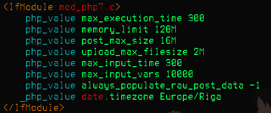


Zabbix ya está instalado correctamente en nuestro sistema. Configuremos ahora el frontend siguiendo el
siguiente [tutorial](https://www.zabbix.com/documentation/3.4/manual/installation/install#installing_frontend)

En el navegador, vamos a la dirección: http://192.168.56.4/zabbix y seguimos los pasos indicados:

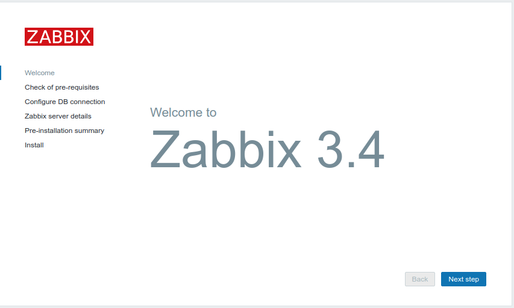
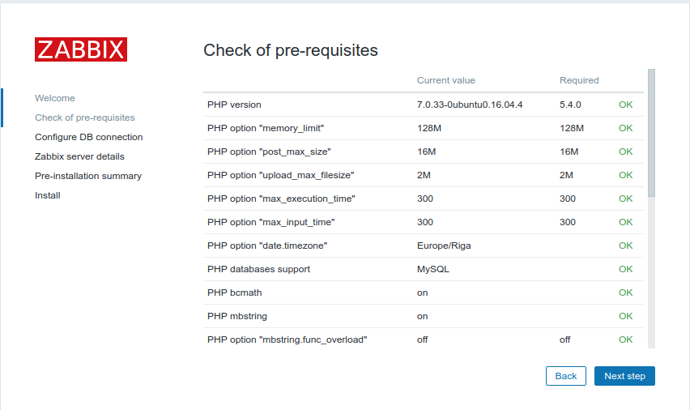
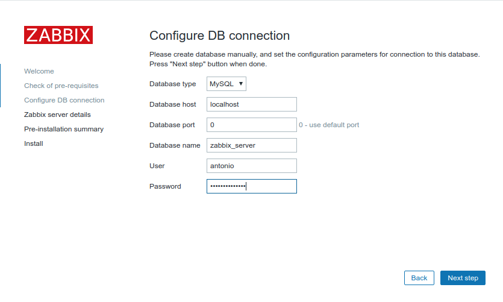

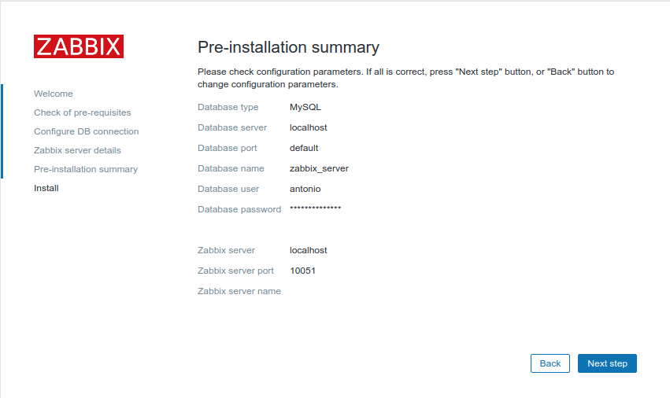
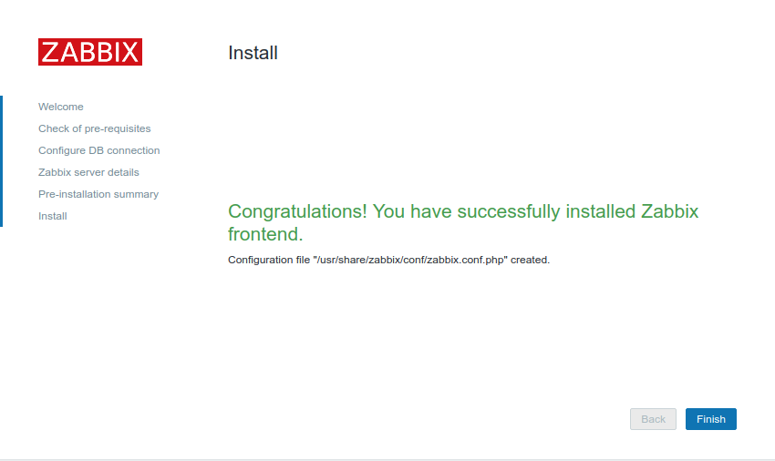

Una vez hecho eso, nos logeamos en Zabbix con el usuario y contraseña por defecto: Admin y Zabbix:

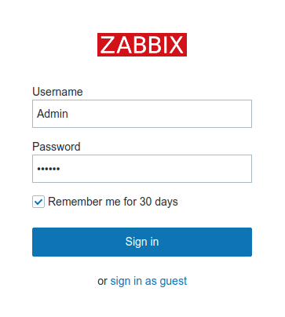

Activamos los puertos 10050 y 10051 sobre tcp en el firewall:

```
sudo ufw allow 10050/tcp
sudo ufw allow 10051/tcp
```

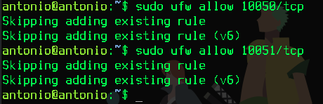

Ahora creamos un host como indica [aquí](https://www.zabbix.com/documentation/3.4/manual/quickstart/host), quedando (el primero es el que viene por defecto):

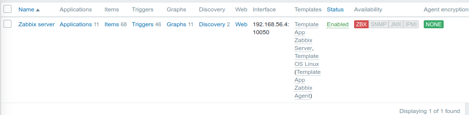

Me ha dado un error en el agente, que dice que no podía conectarse al host porque no estaba permitido (este error sale en el frontend de zabbix como que el agente no es alcanzable y en el log de zabbix_agentd). Lo ha solucionado añadidendo la IP de ubuntu a los hosts permitidos en el archivo de configuración de `zabbix_agentd` (`/etc/zabbix/zabbix_agentd.conf`):


Error solucionado:


Ya solo queda añadir el item de SSH y el de HTTP como se indica [aquí](https://www.zabbix.com/documentation/3.4/manual/quickstart/item).

Vemos que estamos monitorizando correctamente SSH y HTTP. Desactivamos SSH con `systemctl stop ssh.service` y vemos que toma el valor 0:

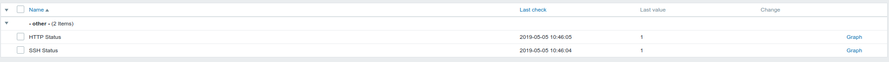


El servicio de HTTP (Apache)

Ahora tenemos que instalar el agente en CentOS, siguiendo el siguiente [tutorial](https://www.zabbix.com/documentation/3.4/manual/installation/install_from_packages/rhel_centos).

```
sudo rpm -ivh https://repo.zabbix.com/zabbix/3.4/rhel/7/x86_64/zabbix-release-3.4-2.el7.noarch.rpm
sudo yum install zabbix-agent
service zabbix-agent start
```

Lo anterior dará error por lo que aplicamos la solución descrita [aquí](https://support.zabbix.com/browse/ZBX-14922).

Abrimos los puertos que necesita el agente:

```
sudo firewall-cmd --add-port=10050/tcp --permanent
sudo firewall-cmd --add-port=10051/tcp --permanent
systemctl restart firewalld
systemctl restart zabbix-agent
```

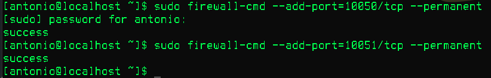

Importante: también hay que modificar `/etc/zabbix/zabbix_agentd.conf` y añadir en las opciones `Server` y `ServerActive` la IP de la máquina donde está el servidor de Zabbix (Ubuntu).

Ahora creamos un nuevo host y le añadimos 2 items nuevos como hemos hecho antes. Además paramos los servicios SSH y HTTP y vemos que están siendo monitoreados correctamente:

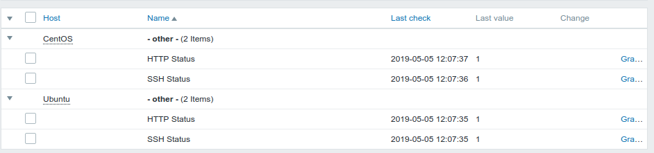
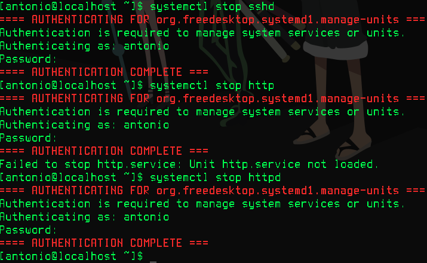

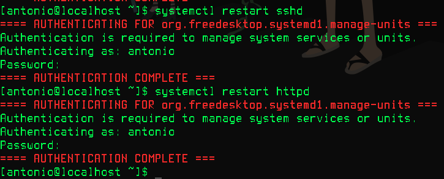
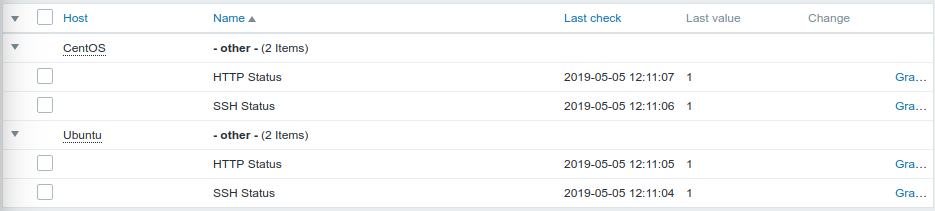

### Referencias

- [Manual de Zabbix](https://www.zabbix.com/documentation/3.4/manual)
- [Lista de item keys](https://www.zabbix.com/documentation/3.4/manual/config/items/itemtypes/zabbix_agent)
- [Bug CentOS](https://support.zabbix.com/browse/ZBX-14922)
