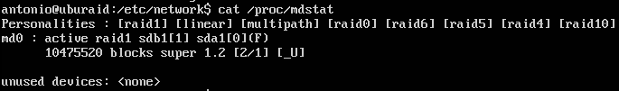

### Lección 2: Monitorizar raid y Ansible.

Antes de todo hay que preparar una máquina virtual con Ubuntu con un raid, seguid los pasos descritos [aquí](https://github.com/antoniogamiz/tercero-dgim/blob/master/ISE/practica1.md). No hace falta encriptar los discos. Además hace instalar el gestor de arranque en `/dev/sdb` con `grub-install /dev/sdb` y configurar la red para que nuestra máquina tenga una IP asociada. Además tienes que configurar `ssh` como se describe [aquí](https://github.com/antoniogamiz/tercero-dgim/blob/master/ISE/practica2.md).

Arrancamos ahora la máquina y nos conectamos mediante `ssh` para que sea más fácil meter los comandos.

Vamos a monitorizar un archivo que se encuentra en `/proc/mdstat`. Con el comando `mdadm --detail /dev/md0` también podemos ver el estado de un raid.

Vamos a corromper el raid a propósito con el comando `mdadm --set-faulty /dev/md0 /dev/sda1` y reiniciamos con `reboot`. Si ahora comprobamos el estado del raid vemos que sale lo siguiente:



Nos fijamos que al final de la penúltima línea sale `[_U]`. Eso significa que hay dos discos en el raid (porque hay dos caracteres) y que uno de ellos está caído (guión bajo) y otro está funcionando correctamente (el de la U). Si ahora volvemos a levantar el disco anterior con `mdadm --add /dev/md0 /dev/sda1` veremos que aparecerá `[UU]`.

Con `watch -n 1 cat /proc/mdstat` puedes ver como avanza la recuperación del disco.

Ahora creamos el siguiente script en bash:

La regex que aparece ahí es fácil comprobar que funciona en la página https://regexr.com/.

```
#!/bin/bash

[ ! -f /proc/mdstat ] && exit 0
grep \[.*_.*\] /proc/mdstat >& /dev/null
if [ $? -eq 0 ]; then
    echo "RAID OK"
else
    echo "RAID KO"
fi
```

Metemos eso en un archivo `script.sh` en nuestro home y le damos permisos de ejecución con `chmod +x script.sh`. Podemos tirar el disco otra vez y probar que el script funcione.

Ahora vamos a crear un proceso periódico con `systemd`. Con `systemctl list-timers` podemos ver los timers del sistema. También le podemos añadir la opción `--all` para verlos todos.

Tenemos que crear dos archivos:

check-raid.timer

```
[Unit]
Description=check estado raid

[Timer]
OnCalendar=minutely

[Install]
WantedBy=timer.target
```

check-raid.service

```
[Unit]
Description=check estado raid

[Service]
Type=simple
ExecStart=/home/antonio/script.sh
```

Esos archivos hay que crearlos en `/etc/systemd/system/`.

Ahora ejecutamos lo siguiente:

```
systemctl enable check-raid.timer
systemctl start check-raid.timer
```

Con el comando `journalctl -u check-raid` podemos ver info de cómo se va ejecutando cada minuto.

Ahora tiramos el disco, vemos que funciona el service y lo volvemos a levantar. Para evitar tener que reiniciar a la hora de quitar el disco podemos usar `--remove` en lugar de `--set-faulty`.
