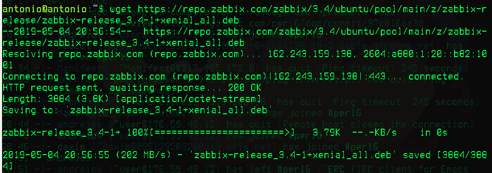
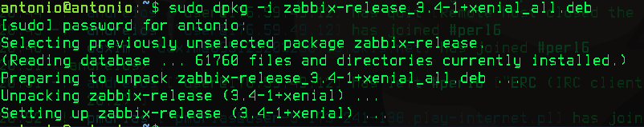
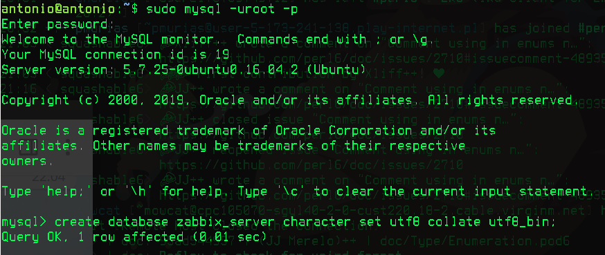
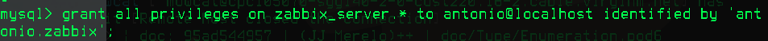
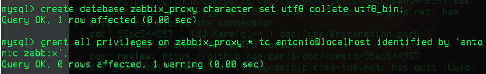
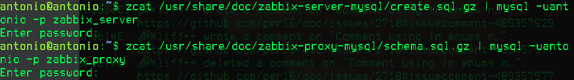

### Instalación de Zabbix

Nos conectamos a Ubuntu y CentOS en dos terminales mediante:

```
ssh antonio@192.168.56.4
ssh antonio@192.168.56.5
```

Una vez conectados, en Ubuntu, instalamos Zabbix como indica en la [página de instalación](https://www.zabbix.com/documentation/3.4/manual/installation/install_from_packages/debian_ubuntu):

```
wget https://repo.zabbix.com/zabbix/3.4/ubuntu/pool/main/z/zabbix-release/zabbix-release_3.4-1+xenial_all.deb
dpkg -i zabbix-release_3.4-1+bionic_all.deb
apt update
```




Ahora vamos a instalar el servidor, el proxy y el frontend, usando MySQL aprovechando que ya lo tenemos
instalados de la práctica anterior:

```
apt install zabbix-server-mysql
apt install zabbix-proxy-mysql
apt install zabbix-frontend-php
```


Ahora vamos a crear las correspondientes bases de datos en MySQL para el servidor y el proxy, siguiendo este [tutorial](https://www.zabbix.com/documentation/3.4/manual/appendix/install/db_scripts#mysql):

```
sudo mysql -uroot -pantonio
create database zabbix_server character set utf8 collate utf8_bin;
grant all privileges on zabbix_server.* to antonio@localhost identified by 'antonio.zabbix';
create database zabbix_proxy character set utf8 collate utf8_bin;
grant all privileges on zabbix_proxy.* to antonio@localhost identified by 'antonio.zabbix';
```





Importamos ahora los esquemas para la base de datos:

```
zcat /usr/share/doc/zabbix-server-mysql/create.sql.gz | mysql -uantonio -p zabbix_server
zcat /usr/share/doc/zabbix-proxy-mysql/schema.sql.gz | mysql -uantonio -p zabbix_proxy

```



Editamos los archivos de configuración del server y proxy de Zabbix:

```
sudo vi /etc/zabbix/zabbix_server.conf
sudo vi /etc/zabbix/zabbix_proxy.conf
```

Quedando:

```
DBHost=localhost
DBName=zabbix_server
DBUser=antonio
DBPassword=antonio.zabbix
```

```
DBHost=localhost
DBName=zabbix_proxy
DBUser=antonio
DBPassword=antonio.zabbix
```

Activamos los servicios y los configuramos para que se enciendan cuando el ordenador y reiniciamos
Apache:

```
service zabbix-server start
update-rc.d zabbix-server enable
service zabbix-proxy start
update-rc.d zabbix-proxy enable
servicec apache2 restart
```


Zabbix ya está instalado correctamente en nuestro sistema. Configuremos ahora el frontend siguiendo el
siguiente [tutorial](https://www.zabbix.com/documentation/3.4/manual/installation/install#installing_frontend)

### Referencias

- [Manual de Zabbix](https://www.zabbix.com/documentation/3.4/manual)

### Notas mias

192.168.56.4 => Ubuntu
192.168.56.5 => CentOS
aniadir los links que voy poniendo a la parte de referencias
