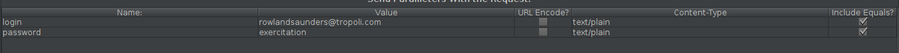
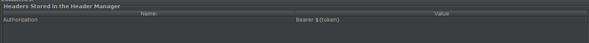
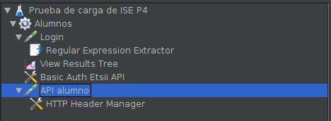
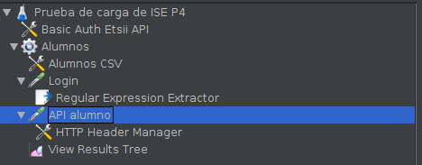

# P4: Benchmarking

## L1: Phoronix Test Suit Apache Benchmark

Documentación [aquí](https://www.phoronix-test-suite.com/).

Arrancamos la máquina de Ubuntu, nos conectamos mediante ssh y:

```
sudo apt-get install phoronix-test-suite
```

Ahora ponemos en la terminal `phoronix-test-suite` y le damos a todo enter.

Con:

```
phoronix-test-suite detailed-system-info
phoronix-test-suite system-sensors
```

podemos ver información del sistema y de sus sensores.

Es necesario que ejecutemos `sudo apt-get install php-zip` para continuar.

En Phoronix hay dos tipos de benchmarks: los test and see y las agrupaciones (varios benchmarks juntos). Para ver los que están disponibles: `phoronix-test-suite list-available-suites`. No vamos a usar suites porque tardan mucho en ejecutarse, solo nos descargaremos benchmarks (test and see). Todos los benchmarks tienen un nombre único, una breve descripción y un tipo.

Para buscar benchmark que midan el procesador (que tienen menos dependencias) hacemos: `phoronix-test-suit list-available-tests | grep -i processor`. Para ver más información sobre alguno: `phoronix-test-suite info <nombre>` (el nombre es la primera columna).

Yo voy a escoger el benchmark `pts/perl-benchmark` (el profesor escogió `pts/system-decompress-bzip2`).
Para instalarlo ejecutamos: `phoronix-test-suite install <nombre>`. Para ejecutarlo `phoronix-test-suite <nombre>`.

Los resultados que nos de no nos sirve de mucho porque necesitamos una referencia con los que compararlos. Si queremos recuperar resultados antiguos: `phoronix-test-suite list-saved-results`. Para ver el contenido: `phorenix-test-suite result-file-to-text <idEjecucion>`.

El comando `phoronix-test-suite benchmark <nombre>` es lo mismo que instalarlo y ejecutarlo justo después.

**Lo que pide el profe**:

- Descargarse un benchmark.
- Instalarlo correctamente (con las dependencias que necesite).
- Consultar su documentación para saber qué hace.
- Comprender qué está midiendo el benchmark.

## L1.2 Apache Benchmark

Se instala cuando instalamos Apache así que ya deberíamos tenerlo.

```
ab -n 1 http://ugr.es
```

- `-n`: request => Number of requests to perform for the benchmarking session. The default is to just perform a single request which usually leads to non-representative benchmarking results.
- `-c`: concurrency => Number of multiple requests to perform at a time. Default is one request at a time.
- `-t`: timelimit => Maximum number of seconds to spend for benchmarking. This implies a -n 50000 internally. Use this to benchmark the server within a fixed total amount of time. Per default there is no timelimit.

El tiempo de conexión es en milisegundos, es el tiempo que pasa desde que se abre el socket hasta que se establece la conexión. Processing es el tiempo que pasa hasta que recibimos el primer byte del resultado. Waiting es el tiempo restante de la conexión. Luego aparecen los percentiles.

El profe va a pedir que hagamos esto pero contra CentOS, así que encemos CentOS y ejecutamos desde nuestra máquina:

```
ab -n 100 -c 4 <ipcentos>
```

## L2: Jmeter

Esta lección la haremos en el anfitrión porque necesitamos una interfez gráfica.

Lo que hay que instalar y configurar se explica [aquí](https://github.com/davidPalomar-ugr/iseP4JMeter).

Para instalar Jmeter: https://linuxhint.com/install_apache_jmeter_ubuntu/.

Abrimos Jmeter como explica en el link anterior y le ponemos un nombre al plan: Prueba de carga de ISE P4. Cada thread
es un usuario (la simulación de uno). Damos click derecho sobre el flask azul -> add -> threads (users) -> thread group.
Le llamamos alumnos.

Hacemos click derecho sobre alumnos -> add -> sampler -> HTTP Request. Le llamamos login. Le ponemos puerto 3000 y host localhost, método POST y path /api/v1/auth/login. Ahora, en la tabla de abajo que se llama Parameters, añadimos uno que
se llame login y password (cogemos cualquiera del fichero de alumnos.csv de la carpeta jMeter del repo del profe).



Para ver si funciona lo que llevamos hecho hacemos click derecho sobre alumnos -> add -> listener -> view results tree. Después le damos al triángulo verde de arriba y nos pedirá que guardemos el proyecto, lo hacemos y vemos que después se
ejecuta la prueba y que sale login en rojo. Pinchamos y nos da información del error. Debería aparecer algo de Unauthorized (error 401), eso es porque no hemos pasado el Basic auth.

Para arreglarlo hacemos click derecho sobre alumnos -> add -> config element -> http authorization manager. Le ponemos de nombre Basic Auth Etsii API. En la table de abajo le damos a Add y ponemos en base url http://localhost:3000/api/v1/auth/login, en username etsiiApi y en password laApiDeLaETSIIDaLache. Volvemos a ejecutarlo y ya debería ir. En View Results Tree debería aparecernos Login en verde y si pinchamos en él y luego en Responde Data vemos una tira de letras raras que es nuestro token. En jwt.io podemos comprobar su validez y lo que contiene.

Hacemos click derecho sobre alumno -> add -> sampler -> http request. Le ponemos de nombre Api alumno. Host, port como antes y método GET. En path ponemos: /api/v1/alumnos/alumno/rowlandsaunders%40tropoli.com. Cuidado que tenemos que cambiar el @ por %40.

Hay que añadir también el token a la petición. Click derecho sobre Login -> add -> post processors -> Regular expression extractor. Le ponemos de nombre Extract JWT Token. En Name of the created variable le ponemos token, en regular expression ponemos .+ y en template ponemos $0$.

Ahora click derecho sobre API alumno -> add -> config element -> http header manager. Le damos a Add y lo dejamos así:



Asegurarse que lo de la izquierda esté así:



Ahora lo ejecutamos otra vez y deberían salir las dos peticiones en verdes (en view results tree).

Si ahora pinchamos en Prueba de carga de ISE P4, veremos que hay una tabla a la derecha que se llama User Defined Variables, añadimos dos: una que se llame HOST con valor localhost y otra PORT con valor 3000. Estas variables se pueden modificar luego desde la línea de comandos. Ahora tenemos que cambiar en todos los sitios donde hayamos puesto localhost y 3000 por ${HOST} y ${PORT} respectivamente.

Movemos los archivos de la carpeta jMeter del repositorio a la carpeta donde tengamos jmeter.

Ahora hacemos click derecho sobre alumnos -> add -> config element -> CSV Data Set Config y lo llamamos Alumnos CSV. En filenome ponemos el nombre del archivo (path relativo). Como el archivo csv tiene una linea de cabecera al principio, las variables login y password se crearán solas.

Pinchamos en el elemento que antes hemos llamado login y la variable login, su valor, lo sustituimos por ${__urlencode(${login})} y el valor de password por \${password}. Y en API Alumno igual, el correo lo cambiamos por ${__urlencode(${login})}.

He reordenado un poco las cosas y debería quedar así:



Ahora ya solo quedaría ponerle la carga necesaria. Vamos a Alumnos, en número de threads ponemos 500, en ramp-up period 10 (es el número de segundos que pasan desde que tenemos 0 hebras hasta las que le digamos) y en loop count ponemos 20 (el número de veces que cada hebra repetirá su trabajo).

Mientras eso se ejecuta en `localhost:3000/status` podemos ver estadísticas del servidor en tiempo real.

Es bueno añadir temporizadores que retrasen aleatoriamente cada petición, click derecho sobre alumnos -> add -> timer -> gaussian random timer y de nombre le ponemos Espera un poco y constant delay 3000 y desviación 500. Lo ponemos después del Login Alumno como en la foto que hay al final del repositorio.

Con click derecho sobre alumnos -> add -> listener -> Summary Report y -> Aggreagete Report podemos ver más estadísticas sobre la prueba de carga que hemos hecho (tienes que añadirlos antes de ejecutar la prueba).

Valep, primera parte hecha. Ahora vamos a hacer casi lo mismo pero con los administradores. Hacemos click derecho sobre alumnos -> copy, click derecho sobre el flask azul y paste. Le cambiamos el nombre de Alumnos a Administradores y en el path del archivo csv también.

Ahora con click derecho sobre Administradores -> add -> sampler -> Access Log Sampler. Movemos lo de JWT Token dentro de eso y desactivamos el API Administradores de antes. En log file ponemos apiAlumnos.log. Y en server ${HOST} y port ${PORT}.

Para lanzarlo desde la línea de comandos:

```
jmeter.sh -n -t ./usep4.jmx -l results.jtl -JHOST=localhost -JPORT=3000
```

Ahora solo hay que subir en un zip el archivo .jmx y el .jtl a la zona de trabajos de Swad.
