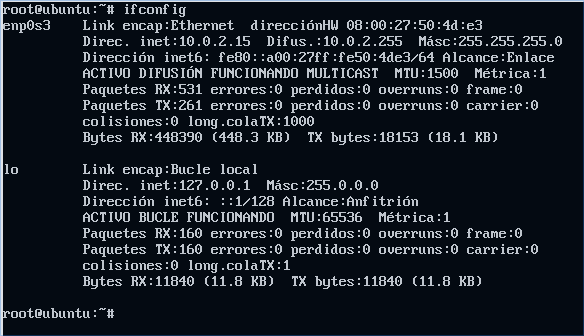
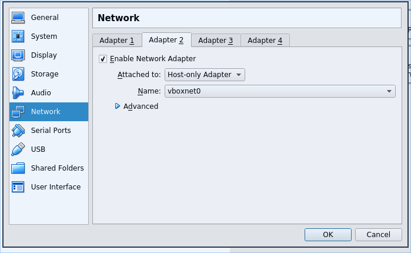
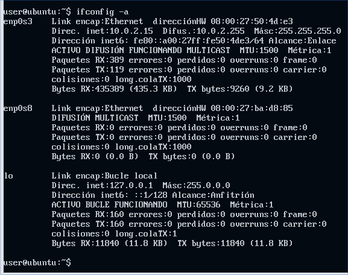
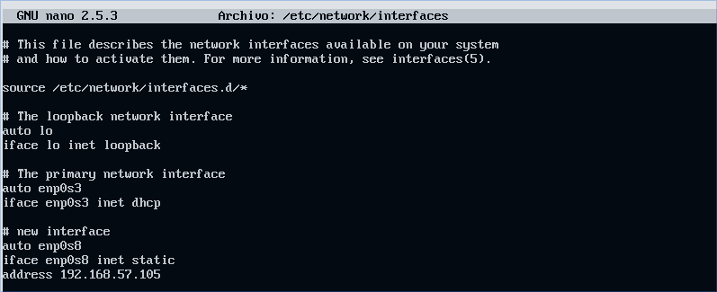
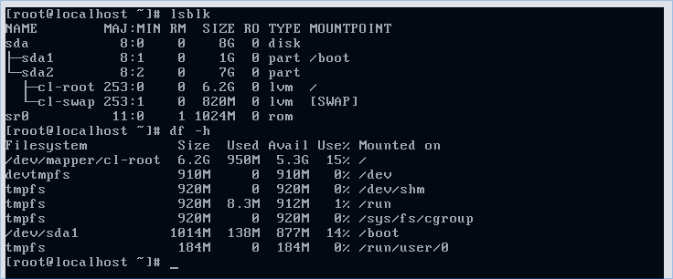
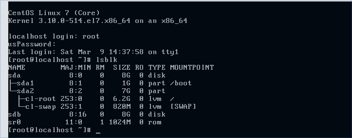
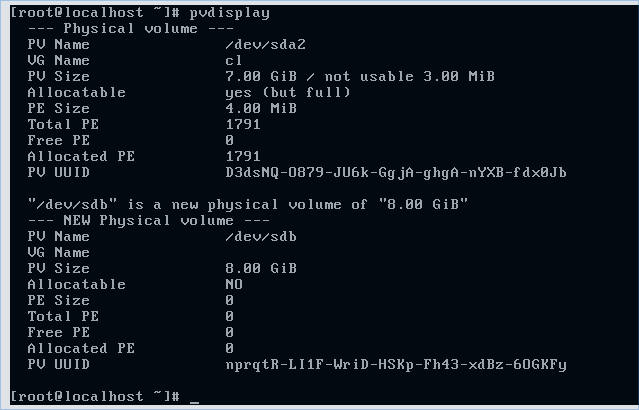
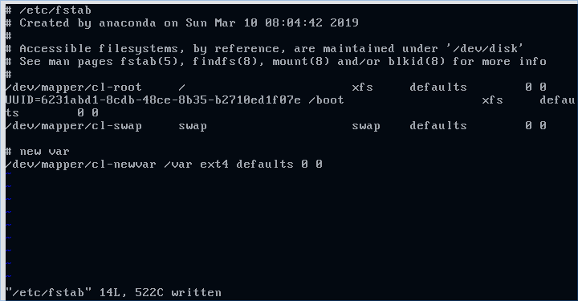
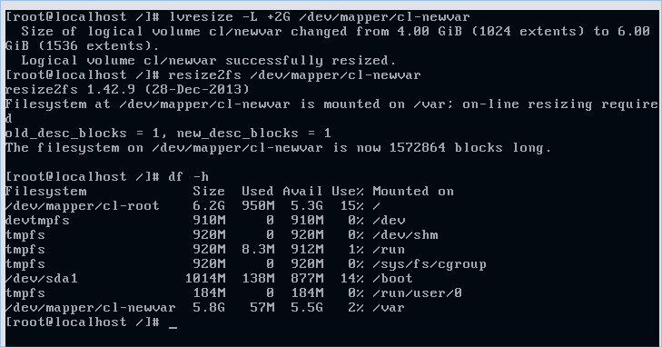
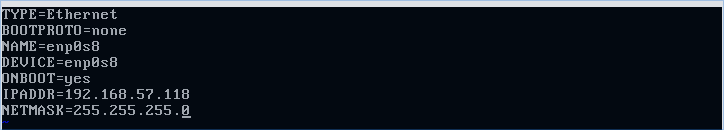

# Práctica 0

## Sesión 1 (Ubuntu)

### Parte 1: Configuración de VM y de los discos

1. Descargar las siguientes imágenes:

```
http://atcproyectos.ugr.es/esriie/ubuntu-16.04.5-server-amd64.iso
http://atcproyectos.ugr.es/esriie/CentOS-7-x86_64-Minimal-1611.iso
```

2. Definir una nueva máquina virtual en Virtual Box

   - Nombre: ubuise1.
   - Tipo: Linux.
   - Versión: Ubuntu 64 bits.
   - Lo demás por defecto (darle siempre a Next, a lo del disco duro también)

3. Click derecho sobre la máquina virtual -> Settings -> Storage.

   1. Primero añadimos la ISO de Ubuntu: (botoncico del cd) .
   2. Luego pulsamos _Choose disk_ y seleccionamos la ISO de Ubuntu que nos hemos descargado.
   3. Opcionalmente podemos borrar el disco donde pone _Empty_.
   4. Ahora tenemos que crear un nuevo disco (botón de la derecha): 
   5. Luego le damos a crear _Create new disk_ y lo dejamos todo por defecto (nombre _ubuise2_, para que sea más reconocible después).

4. Encedemos la máquina virtual y seguimos las instrucciones:

   - El espacio sirve para pinchar sobres las opciones.
   - **NO** cifrar nuestra carpeta personal
   - Usuario: user. Password: practicaISE.
   - Particionado -> **Manual**.
   - Ahora te aparecerán dos discos, algo así:

   

   - Te metes en cada uno de ellos y le das a que sí cuando te pregunte si quieres crear la tabla de particiones. Te debería quedar así:

   

   - Le damos a _Configuración del RAID por software_
   - Le damos a que sí cuando nos pregunta si queremos escribir los cambios en disco.
   - Cuando llegemos a aquí, seleccionamos la opción _Crear un dispositivo MD_.

   

   - Seleccionamos _RAID 1_ => Número de dispositivos del RAID: _2_ => Número de dispositivos libres para el RAID: _0_.
   - Seleccionamos los dos discos para el RAID (con barra espaciadora y luego ENTER)

   

   - Guardamos los cambios y le damos a _Terminar_ =>

5. Ahora le damos a _Configurar el sistema de volúmenes lógicos_ => Le damos a que _sí_ queremos mantener las particiones => Crear grupo de volúmenes => Le ponemos de nombre _servidor_:

   

   Seleccionamos ese disco con barra espaciadora y le damos a enter y luego a que sí.

6. Ahora vamos a crear 4 volúmenes lógicos:

   - le damos a _Crear volumen lógico_ => elegimos _servidor_ => nombre: _arranque_ tamaño: _200MB_
   - Ahora repetimos estos pasos tres veces con estos datos:
     - Nombre: _home_ Tamaño: _1024MB_
     - Nombre: _swap_ Tamaño: _1024MB_
     - Nombre: _raiz_ Tamaño: lo que quede

   Al final le das a _Terminar_ y te tiene que quedar esta pantalla:

   

7. Ahora le damos a _Configurar volúmenes cifrados_ => a que sí => _Created encrypted volumes_ => seleccionas _home_, _raiz_ e _intercambio_ **EL DE ARRANQUE NO** => Ahora le das a _Se ha terminado de definir la partición_ (3 veces, una por cada volumen) => guardas cambios y le das a _Finish_ => Pones 3 contraseñas (pon la misma que luego se te olvida).

8. Ahora le das a enter sobre lo que están en rojo (fíjate bien que ponga home, importante):


En punto de montaje le damos y seleccionamos _/boot_.


Y ya estaría chicos luego le damos a _Se ha terminado de definir la partición_.

Ahora hay que repetir esto para los otros tres _Volumen cifrado (lo que sea aqui)_, seleccionando las mismas opciones, pero en punto de montaje seleccionamos _/_ o _/home_. Para el swap, no hace falta seleccionar punto de montaje, porque en la opción _Utiliar como_ hay que seleccionar _área de intercambio_. Si lo has hecho bien debería quedarte algo así:


9. Halah, baja hasta abajo y selecciona _Finalizar el particionado y escribir los cambios en disco_, aceptar y a rezar. Algo así debería aparecer:


### Parte 2: Instalación del sistema y configuración de red

1. Lo que sale del proxy déjalo en blanco, dale a enter solo. Actualizaciones automáticas tampoco. También dejar en blanco lo de programas a instalar, excepto el _standard system utilities_ que viene por defecto marcado.

2. Te esperas un buen ratico a que termine e instalas el cargador de arranque en _sda_. Luego le das a todo a que sí y demases y pones las contraseñas de tu cifrado.

3. Inicias sesión con tus datos y puedes ejecutar `lsblk` para ver un listado de las particiones, algo así debería aparecer:


Si no sale así bueno, cuando termines de llorar porque te has equivocado, vuelve a arriba y comienza esta épica aventura de nuevo.

4. Ahora poner `sudo bash` y luego `grub-install /dev/sdb` para instalar el cargador de arranque en `sdb`.

5. Ejecuta `ifconfig` y donde pone `enp0s3` es donde aparece la información sobre nuestra interfaz de red virtual. Con `lspci | grep Ether` podemos localizar dicha interfaz. Y con `cat /etc/network/interfaces` podemos ver el contenido del archivo donde vamos a definir nuevas interfaces.

6. Apagamos la máquina ejecutando el comando `poweroff`.

7. Arriba a la izquierda le das a `File` -> `Host Network Manager` -> Iconico verde de crear -> Acuerdate del nombre de la interfaz, seguramente será: _vboxnet0_



8. Le damos a _Esc_ para quitar la ventana que ha aparecido antes. Luego pinchamos sobre la máquina virtual y le damos a Settings, y configuramos como aparece en la foto:



Y encedemos la máquina virtual again. Si todo ha saido bien al ejecutar `ifconfig -a` debería salirte:



9. Ahora ejecutamos todo esto:

```
sudo bash
cp /etc/network/interfaces /etc/network/interfaces.bk (copia de seguridad por si la pifiamos)
lspci | grep Ethernet
nano /etc/network/interfaces
```

Y al final de eso escribimos:



Luego ejecutamos:

```
ifup enp0s8
ifconfig (tenemos que ver que enp0s8 está configurada)
```

Si ahora ejecutamos `ping 192.168.57.105` y funciona, es que lo has hecho bien :D. (esta red no tiene acceso a Internet).

Y esto es todo, aquí termina la sesión 1 (no borres la máquina virtual).

## Sesión 2 (CentOS)

### Parte 1: configuración de los discos

1. Definir una nueva máquina virtual en Virtual Box

   - Nombre: ubuise2.
   - Tipo: Linux.
   - Versión: Red Hat 64 bits.
   - Lo demás por defecto (darle siempre a Next, a lo del disco duro también)

2. Click derecho sobre la máquina virtual -> Settings -> Storage.

   1. Primero añadimos la ISO de CentOS: (botoncico del cd).
   2. Luego pulsamos _Choose disk_ y seleccionamos la ISO de CentOS que nos hemos descargado.
   3. Opcionalmente podemos borrar el disco donde pone _Empty_.
   4. Encedemos la máquina.

3. Instalar, idioma en inglés. Vemos que _Instalation destination_ sale en rojo, eso es porque hay que configurarlo, clickamos sobre él. Y ahora le damos a _Done_ (sin tocar nada antes) que está arriba a la izquierda y luego a _Begin installation_.

   1. **IMPORTANTE:** pon el teclado en español, si no las vas a pasar canutas buscando donde están las teclas.

4. Le ponemos contraseña al usuario _root_ y creamos un usuario para nosotro y cuando se termine de instalar reiniciamos la máquina.

5. Iniciamos sesión como root y ejecutamos `lsblk` para ver las particiones y saldrán las que hace CentOS por defecto. `df -h` muestra el sistema de archivos montados en el sistema y su tamaño. Debería salir esto:



6. Creación de un nuevo disco duro:

   1. `poweroff`
   2. Settings => Storage => SATA => Add disk (como antes vaya, todo por defecto)
   3. Iniciamos la máquina y nos logeamos como root.
   4. Si ejecutamos `lsblk` deberíamos ver el nuevo disco creado.



7. Configuración del _sdb_:

   1. `pvdisplay` => muestra los volúmenes físicos configurados (PV => phisical volume (/dev/sda2), VG => volume group (cl)).
   2. `lvmdiskscan` => ver unidades de disco y cómo de gestionan en VM.
   3. `pvcreate /dev/sdb`
   4. `pvdisplay` => debería aparecer esto:

      

   5. `vgs` => información de volúmenos también.
   6. `vgextend cl /dev/sdb` => para extender el grupo de volúmenes
   7. `vgs` => ahora debería aparecer PV a 2 y en `vgdisplay` ActPV a 2.
   8. `lvdisplay` => para ver los volúmenes configurados
   9. `lvdisplay | more root` (o swap)

8. Creación de un volumen lógico:

   1. `lvcreate -L 4G -n newvar cl`
   2. `lvdisplay | more`
   3. `mkfs -t ext4 /dev/cl/newvar`
   4. `lsblk` (debería aparecer un newvar colgando por ahí, pero sin punto de montaje)
   5. `df -h`

9. Vamos a cambiar el var a newvar:

   1. Arrancamos CentOS en runlevel 1: `systemctl isolate runlevel1.target`
   2. `cd /` (muy **importante**)
   3. `systemctl status` => deberíamos ver _maintenance_ en naranjilla o así.
   4. `mkdir /mnt/vartemp`
   5. `mount /dev/cl/newvar /mnt/vartemp`
   6. `df -h` => en la última línea saldrá _newvar_ montado en _vartemp_
   7. `cp -a /var/* /mnt/vartemp` => copiar conservando metadatos, contexto y recursivamente)
   8. `ls -l /mnt/vartemp` => veremos que está todo lo que antes estaba en var
   9. `mv /var /oldvar` => ya la ruta de _/var_ como tal no existe, está todo movido y los datos en _newvar_.

10. Hacer que los nuevos datos de _newvar_ se pasen a _var_ y que ya sea el definitivo.

    1. mkdir var
    2. cat /etc/fstab
    3. cp /etc/fstab /etc/fstab.bk (copia de seguridad)
    4. nano /etc/fstab (a mi nano no me servia asi que use vi => i para escribir, luego :wq + enter para guardar)

    

    1. `umount /mnt/vartemp`
    2. `mount -a`
    3. `lbslk`
    4. `blkid` (para ver las ids)
    5. `vgs` => Debería aparecer algo como esto

    

11. Ahora vamos a extender (el tamaño) del volumen lógico `newvar`:

    1. `lvresize -L +2G /dev/mapper/cl-newvar` => **Importante** el signo `+`, que si no lo que hace es cambiarle el tamaño a 2G en lugar de ampliarlo.
    2. `lsblk` => debería aparecer el tamaño cambiado (6G)
    3. `df -h` => aquí aparecerá que su tamaño es 4G
    4. Para actualizar ese valor, ejecutar: `resize2fs /dev/mapper/cl-newvar`

    

    5. `reboot` y luego `lsblk`, `df -h`, `ls -la /var` para ver los cambios hechos.

### Parte 2: configuración de red

1. Vamos a configurar una NAT:

   1. `ipaddr` => muestra las interfaces de red (parecido a `ifconfig`)
   2. `cd /etc/sysconfig/network-scripts`
   3. `ls` => veremos los ficheros que se usan para configurar la red
   4. `cat ifcfg-enp0s3` => ver info de esa NAT (`enp0s3`)
   5. `vi ifcfg-enp0s3` y al final del todo cambiamos `ONBOOT=NO` por `ONBOOT=yes` => para que la NAT se activa cuando encendamos la máquina.
   6. `ip addr` => la veremos sin configurar
   7. `ifup ifcfg-enp0s3` => para que se configure
   8. `ip addr` => ya debería aparecer configurada
   9. `poweroff`

2. Como en la sesión anterior, `Settings` -> `Network` -> `Adapter 2` -> `Enable network adapter` -> `host only` -> Iniciar la máquina virtual.

3. `ip addr` => Debería aparecer un adaptador nuevo
4. `cd /etc/sysconfig/network-scripts`
5. `cp ifcfg-enp0s3 ifcfg-enp0s8`
6. `vi ifcfg-enp0s8` y dejarlo como en la siguiente captura:

   

7. `ifup ifcfg-enp0s8` => también está el equivalente `ifdown` que es para desactivar la NAT.
8. Para ver si lo has hecho bien puedes hacer `reboot` y luego `ping 192.168.57.118`: si sale que se mandan paquetitos está todo correcto y ya puedes mandar a esta práctica a tomar viento :).

**IMPORTANTE**: en el examen pueden preguntar qué hacen los comandos que han aparecido aquí, así que estaría bien buscarlo. Además no borres las máquinas virtuales porque puede pedirte que se la enseñes y te haga preguntas.

## Sesión 3 (CentOS + LUKS)

### Parte 1

Primero vamos a hacer una snapshot de la maquina de CentOS (buscarlo en las opciones y darle a take) para guardar el estado de la mv de la sesión anterior.
Hoy vamos a mover el directorio /var de antes a un RAID1, por lo que vamos a tener que añadir dos discos mas y vamos a cifrarlo con LUKS

1. Añadimos dos discos (CentosR1D1 y CentosR1D2)
2. arrancamos la mv
3. lsblk para ver los discos añadidos
4. las utilidades del raid 1 se llaman mdadm (muldi disk administration) hay que instalarlas
5. yum install mdadm
6. mdadm --create /dev/md0/ --level=1 --raid-devices=2 /dev/sdc /dev/sdd(comando para crear raid)
7. Lanzara una advertencia porque al crear una version raid de esta forma no podremos arrancar el sistema desde el raid
8. lsblk y vemos que ya esta hecho el raid 1
9. A partir de aqui es bastante identico a la practica de la semana pasada
10. pvcreate /dev/md0
11. pvdisplay (si añadimos a un mismo grupo de volumenes un disco sin raid y otros con raid el problema que tenemos es que no sabremos si los datos iran a un raid o no, porque lo gestiona lvm)
12. vgcreate radi1 /dev/mod0
13. vgdisplay
14. lvcreate -L +7G -n rvar raid1
15. vgdisplay
16. mkfs -t xfs /dev/raid1/rvar (le hemos dado xfs por variar ha dicho el profe)
17. mount /dev/raid1/rvar /mnt/nvar (reutilizamos el directorio de la practica pasada)
18. IMPORTANTE: ahora necesitamos movernos a sistema monousuario
19. systemctl isolate runlevel1.target
20. cp -a /var/\* /mnt/nvar/
21. cd /
22. cp -a /var /oldvar
23. Ahora editar fichero /etc/fstab
    Sustituimos la ultima linea por eso
    /dev/raid1/rvar /var xfs defaults 0 0
24. umoun /mnt/nvar
25. mount -a
26. reboot
27. cd /
28. rm -rf oldvar
29. lvremove /dev/cl/nvar
30. vgdisplay
31. lvextend -L +6G /dev/cl/root
32. df -h
33. xfs_growfs /dev/cl/root (lo mismo que resize2fs pero este para xfs)

PRIMERA PARTE TERMIANDA

SEGUNDA PARTE

1. Ahora vamos a montar LUKS encima de lvm para cifrar las cosicas.
2. necesitamos instalar la utilidad cryptsetup
   yum install crypsetup (search si no funciona)
   necesitamos reformatear var sin perder el contenido actual por lo que modo mantenimiento
   systemctl isolate runlevel1.target
   cd
   rm -rf var
   cd /
   cp -a var oldvar
   ahora ya
   ahora ya si podemos darle formato de cifrado a var pero esta montado
   umoun /var
   mount : grep var (mount sin parametros nos dice que esta montado)
   cryptsetup luksFormat /dev/raid1/rvar
   lsblk
   ahora vamos a abrir el dispositivo (descifrarlo) para ver como esta configurado
   sin abrirlo no nos dejara montarlo, mount -a dara error
   cryptsetup luksOpen /dev/mapper/raid1-rvar raid1-rvar-crypt (lo ultimo es el nombre que tendra el dispositivo una vez descifrado)
   lsblk
   mkfs -t xfs /dev/mapper/raid1-rvar-crypt
   mount /dev/mapper/raid1-rvar-crypt /mnt/var (no se puede acceder de la otra forma)
   cp -a /oldvar/\* /mnt/nvar

El fichero /etc/crypttab nos permitira descifrar el disco cunado arranque el SO
necesitamos el identificador del volumen odnde vamos a hacerlo (con blkid)
blkid el dev mapper raid1-rvar
blkid : grep crypto > /etc/cryptattab (porque no podemos cortar y pegar)
vi /etc/cryptab
raid1-rvar-crypt UUID=ewfwefew none (importante quitar las comillas)

vi /etc/fstab (cambiamos la ultima lina por eso)
/dev/mapper/raid1-rvar-crypt /var xfs defaults 0 0

umoun /mnt/var
mount -a (lo monta bien porque lo hemos abierto antes)
lo que no hemos podido probar es que el fichero crypttab esta correctamente escrito y ademas no hay forma de hacerlo asi que hacemos reboot y si hay algun error nos saldra la consola para ver que ha pasado )
reboot
