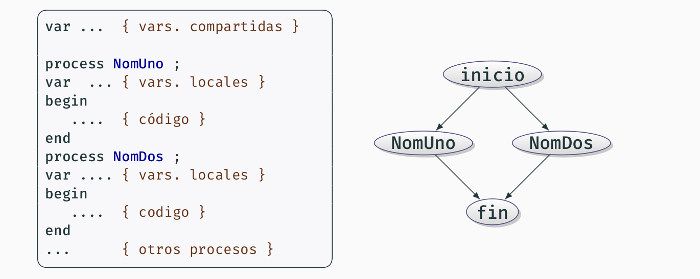
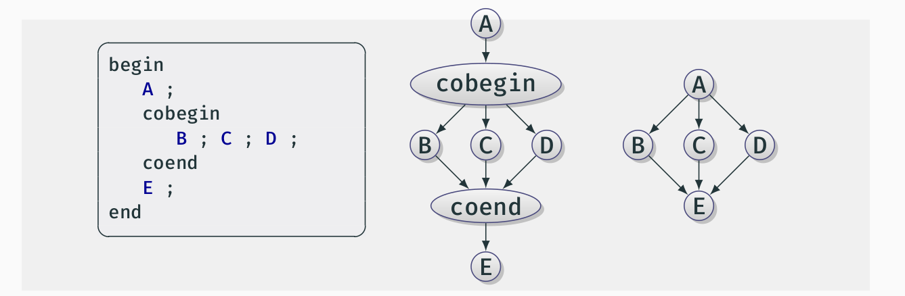
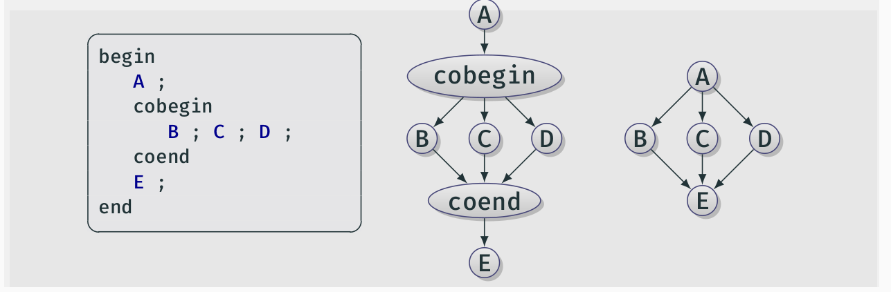

# Tema 1: Introducción a la programación concurrente

* `Sentencia atómica o indivisible`: una sentencia o instrucción de un proceso en un programa concurrente es atómica si siempre se ejecuta de principio a fin sin verse afectada (durante su ejecución) por otras sentencias en ejecución de otros procesos del programa.
    * Al hacer interfoliaciones, las sentencias atómicas se ordenan en función del instante en el que acaban (que es cuando toman efecto).

  
#### Características programas concurrentes:
* `Independencia del entorno de ejecución`: el entrelazamiento preserva la consistencia. El resultado de una instrucción individual sobre un dato no depende de las circunstancias de la ejecución. En caso contrario, sería imposible razonar acerca de la corrección de los programas concurrentes.
* `Hipótesis del progreso finito`: No se puede hacer ninguna suposición acerca de las velocidades absolutas/relativas de ejecución de los procesos, salvo que es mayor que cero. Un programa concurrente se entiende en base a sus componentes (procesos) y sus interacciones, sin tener en cuenta el entorno de ejecución. Esto tiene dos consecuencias:
    * `Punto de vista global`: siempre existirá un proceso preparado, es decir, listo para ejecutarse.
    * `Punto de vista local`: cuando un proceso de un programa concurrente comienza la ejecución de una sentencia, completará la ejecución en un tiempo finito.
* `Estado de un programa concurrente`: valores de las variables del programa en un momento dado.
* `Historia o traza de un programa concurrente`: secuencia de estados (s0, s1,..., sn), producida por una secuencia concreta de interfoliación.
  
#### Creación de procesos:

##### Definición estática de procesos

##### Definición estática de vectores de procesos

##### Creación de procesos no estructurada con fork-join

* `fork`: sentencia que especifica que la rutina nombrada puede comenzar su ejecución, al mismo tiempo qe comienza la sentencia siguiente (bifurcación).
* `join`: sentencia que espera la terminación de la rutina nombrada, antes de comenzar la sentencia siguiente.

##### Creación de procesos estructurada con cobegin-coend

Las sentencias en un bloque delimitado por cobegin-coend comienzan su ejecución todas ellas a la vez: en el `coend` se espera a que se terminen todas las sentencias. Hace explícito qué rutinas van a ejecutarse concurrentemente.

#### Exclusión mutua y sincronización:

* `condición de sincronización`: esto ocurre cuando hay alguna restricción sobre el orden en el que se pueden mezclar las instrucciones ed distintos procesos.
* `exclusión mutua`: (caso particular de condición de sincronización) son secuencias finitas de instrucciones que deben ejecutarse de principio a fin por un único proceso, sin que a la vez otro proceso las esté ejecutando también.