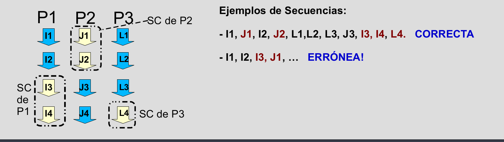
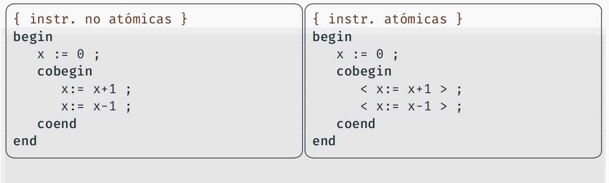

# Tema 1: Introducción a la programación concurrente

* `Sentencia atómica o indivisible`: una sentencia o instrucción de un proceso en un programa concurrente es atómica si siempre se ejecuta de principio a fin sin verse afectada (durante su ejecución) por otras sentencias en ejecución de otros procesos del programa.
    * Al hacer interfoliaciones, las sentencias atómicas se ordenan en función del instante en el que acaban (que es cuando toman efecto).

  
#### Características programas concurrentes:
* `Independencia del entorno de ejecución`: el entrelazamiento preserva la consistencia. El resultado de una instrucción individual sobre un dato no depende de las circunstancias de la ejecución. En caso contrario, sería imposible razonar acerca de la corrección de los programas concurrentes.
* `Hipótesis del progreso finito`: No se puede hacer ninguna suposición acerca de las velocidades absolutas/relativas de ejecución de los procesos, salvo que es mayor que cero. Un programa concurrente se entiende en base a sus componentes (procesos) y sus interacciones, sin tener en cuenta el entorno de ejecución. Esto tiene dos consecuencias:
    * `Punto de vista global`: siempre existirá un proceso preparado, es decir, listo para ejecutarse.
    * `Punto de vista local`: cuando un proceso de un programa concurrente comienza la ejecución de una sentencia, completará la ejecución en un tiempo finito.
* `Estado de un programa concurrente`: valores de las variables del programa en un momento dado.
* `Historia o traza de un programa concurrente`: secuencia de estados (s0, s1,..., sn), producida por una secuencia concreta de interfoliación.
  
#### Creación de procesos:

##### Definición estática de procesos

##### Definición estática de vectores de procesos

##### Creación de procesos no estructurada con fork-join

* `fork`: sentencia que especifica que la rutina nombrada puede comenzar su ejecución, al mismo tiempo qe comienza la sentencia siguiente (bifurcación).
* `join`: sentencia que espera la terminación de la rutina nombrada, antes de comenzar la sentencia siguiente.

##### Creación de procesos estructurada con cobegin-coend

Las sentencias en un bloque delimitado por cobegin-coend comienzan su ejecución todas ellas a la vez: en el `coend` se espera a que se terminen todas las sentencias. Hace explícito qué rutinas van a ejecutarse concurrentemente.

#### Exclusión mutua y sincronización:

* `condición de sincronización`: esto ocurre cuando hay alguna restricción sobre el orden en el que se pueden mezclar las instrucciones ed distintos procesos.
* `exclusión mutua`: (caso particular de condición de sincronización) son secuencias finitas de instrucciones que deben ejecutarse de principio a fin por un único proceso, sin que a la vez otro proceso las esté ejecutando también. Al conjunto de dichas instrucciones se denomina `sección crítica`. Ejemplo común: cuando process con memoria compartida que acceden para leer y modificar variables o estructuras de datos comunes usando operaciones no atómicas.

Notación para expresar instrucciones no atómicas que queremos que se ejecuten como atómicas: 

#### Concepto de corrección de un programa concurrente:

* `Propiedad de un programa concurrente`: atributo del programa que es cierto para todas las posibles secuencias de interfoliación. Hay dos tipos:
    * `Propiedad de seguridad (safety)`: son condiciones que deben cumplirse en cada instante (del tipo: "nunca pasará nada malo"). Ejemplos:
        * Exclusión mutua: 2 procesos nunca entrelazan ciertas subsecuencias de operaciones.
        * Ausencia de interbloqueo (deadlock-freedom):  nunca ocurrirá que los procesos se encuentren esperando a algo que nunca ocurrirá.
        * Propiedad de seguridad en el Productor-Consumidor: el consumidor debe consumir todos los datos producidos por el productor en el orden en que se van produciendo.
    * `Propiedad de vivacidad (liveness)`: son propiedades que deben cumplirse eventualmente (del tipo: "realmente sucede algo bueno"). Ejemplos:
        * Ausencia de inanición (starvation-freedom): un proceso o grupo de procesos no puede ser indefinidamente pospuesto. En algún momento, podrá avanzar.
        * Equidad (fairness): un proceso que desee progresar debe hacerlo con justicia relativa con respecto a los demás. Más ligado a la implementación y a veces incumplida.

#### Verificación de programas concurrentes:

* Enfoque axiomático: se define un sistema lógico formal que permite establecer propiedades de programas en base a axiomas y reglas de inferencia. Se usan fórmulas lógicas para caracterizar un conjunto de estados. Los teoremas en la lógica tienen la forma: $\{P\} \quad S \quad \{Q\} $. Que significa: si la ejecución de la sentencia $S$ empieza en algún estado en el que es verdadero el predicado $P$ (precondición), entonces el predicado $Q$ (postcondición) será verdadero en el estado resultante.
* Invariante global: predicado que referencia variables globales siendo cierto en el estado inicial de cada proceso y manteniéndose cierto ante cualquier asignación dentro de los procesos. Ejemplo: en una solución correcta del Productor-Consumidor, un invariante global sería: $ consumidos \leq producidos \leq consumidos+1$